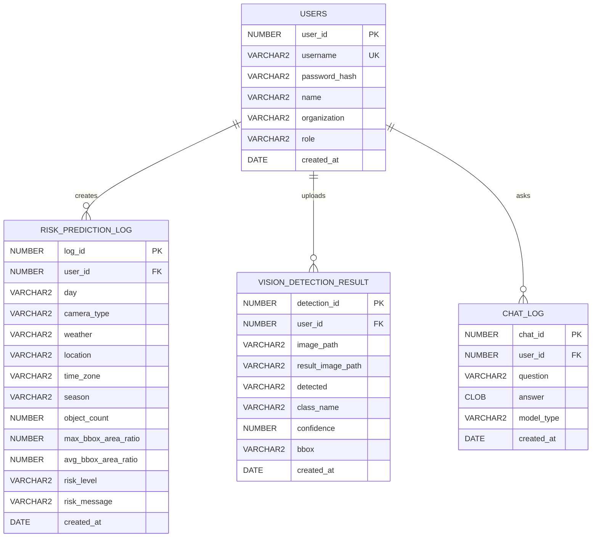

# WildGuard AI ERD

## 1. 목적
WildGuard AI의 회원, 위험도 예측 기록, 향후 이미지 탐지 결과, 상담 로그의 DB 구조를 정리한다.

## 2. ERD



## 3. USERS

| 컬럼 | 타입 | 설명 |
|---|---|---|
| user_id | NUMBER | 사용자 ID |
| username | VARCHAR2(50) | 로그인 아이디 |
| password_hash | VARCHAR2(255) | 해시 비밀번호 |
| name | VARCHAR2(50) | 이름 |
| organization | VARCHAR2(100) | 소속 |
| role | VARCHAR2(30) | 사용자 유형 |
| created_at | DATE | 가입일 |

role 값: citizen, farmer, ranger, official, admin

```sql
CREATE TABLE users (
    user_id NUMBER PRIMARY KEY,
    username VARCHAR2(50) UNIQUE NOT NULL,
    password_hash VARCHAR2(255) NOT NULL,
    name VARCHAR2(50) NOT NULL,
    organization VARCHAR2(100),
    role VARCHAR2(30) DEFAULT 'citizen',
    created_at DATE DEFAULT SYSDATE
);

CREATE SEQUENCE users_seq START WITH 1 INCREMENT BY 1 NOCACHE;

CREATE OR REPLACE TRIGGER trg_users
BEFORE INSERT ON users
FOR EACH ROW
BEGIN
    IF :NEW.user_id IS NULL THEN
        SELECT users_seq.NEXTVAL INTO :NEW.user_id FROM dual;
    END IF;
END;
/
```

## 4. RISK_PREDICTION_LOG

| 컬럼 | 타입 | 설명 |
|---|---|---|
| log_id | NUMBER | 로그 ID |
| user_id | NUMBER | 사용자 ID |
| day | VARCHAR2(20) | 주야간 |
| camera_type | VARCHAR2(20) | 카메라 유형 |
| weather | VARCHAR2(30) | 날씨 |
| location | VARCHAR2(100) | 위치 |
| time_zone | VARCHAR2(20) | 시간대 |
| season | VARCHAR2(20) | 계절 |
| object_count | NUMBER | 객체 수 |
| max_bbox_area_ratio | NUMBER | 최대 bbox 면적 비율 |
| avg_bbox_area_ratio | NUMBER | 평균 bbox 면적 비율 |
| risk_level | VARCHAR2(20) | 예측 위험도 |
| risk_message | VARCHAR2(500) | 대응 메시지 |
| created_at | DATE | 생성일 |

```sql
ALTER TABLE risk_prediction_log ADD user_id NUMBER;
```

## 5. 예정 테이블

### VISION_DETECTION_RESULT
2차 YOLO 이미지 탐지 결과 저장용 테이블이다.

### CHAT_LOG
3차 LLM, 4차 SLM 상담 기록 저장용 테이블이다.

## 6. 설계 원칙
- 비회원 예측 결과는 저장하지 않는다.
- 로그인 사용자 예측 결과만 저장한다.
- 비밀번호는 평문이 아니라 hash로 저장한다.
- DB 변경사항은 `database/migrations/*.sql` 파일로 관리한다.
