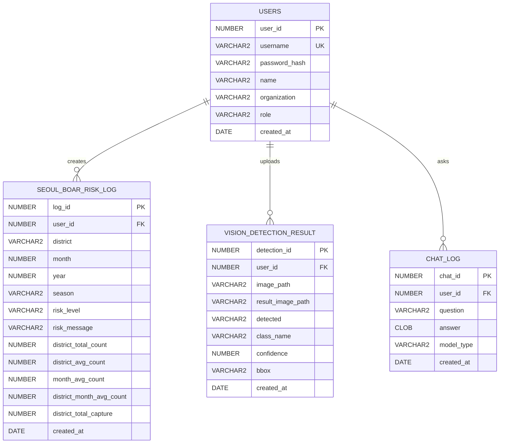

# WildGuard AI ERD

## 1. 목적

WildGuard AI의 회원, 서울시 멧돼지 위험도 예측 기록, 향후 이미지 탐지 결과, 상담 로그의 DB 구조를 정리한다.

현재 1차 ML은 기존 AI Hub 메타데이터 기반 위험도 예측에서 **서울시 멧돼지 민원신고 현황 데이터 기반 자치구·월별 위험도 예측**으로 변경되었다.

---

## 2. ERD



---

## 3. USERS

| 컬럼 | 타입 | 설명 |
|---|---|---|
| user_id | NUMBER | 사용자 ID |
| username | VARCHAR2(50) | 로그인 아이디 |
| password_hash | VARCHAR2(255) | 해시 비밀번호 |
| name | VARCHAR2(50) | 이름 |
| organization | VARCHAR2(100) | 소속 |
| role | VARCHAR2(30) | 사용자 유형 |
| created_at | DATE | 가입일 |

role 값:

```text
citizen, farmer, ranger, official, admin
```

```sql
CREATE TABLE users (
    user_id NUMBER PRIMARY KEY,
    username VARCHAR2(50) UNIQUE NOT NULL,
    password_hash VARCHAR2(255) NOT NULL,
    name VARCHAR2(50) NOT NULL,
    organization VARCHAR2(100),
    role VARCHAR2(30) DEFAULT 'citizen',
    created_at DATE DEFAULT SYSDATE
);

CREATE SEQUENCE users_seq
START WITH 1
INCREMENT BY 1
NOCACHE;

CREATE OR REPLACE TRIGGER trg_users
BEFORE INSERT ON users
FOR EACH ROW
BEGIN
    IF :NEW.user_id IS NULL THEN
        SELECT users_seq.NEXTVAL INTO :NEW.user_id FROM dual;
    END IF;
END;
/
```

---

## 4. SEOUL_BOAR_RISK_LOG

1차 ML 위험도 예측 결과를 저장하는 테이블이다.

| 컬럼 | 타입 | 설명 |
|---|---|---|
| log_id | NUMBER | 로그 ID |
| user_id | NUMBER | 사용자 ID |
| district | VARCHAR2(50) | 서울시 자치구 |
| month | NUMBER | 입력 월 |
| year | NUMBER | 기준 연도 |
| season | VARCHAR2(20) | 계절 |
| risk_level | VARCHAR2(20) | 예측 위험도 |
| risk_message | VARCHAR2(500) | 대응 메시지 |
| district_total_count | NUMBER | 자치구 총 출현개체수 |
| district_avg_count | NUMBER | 자치구 평균 출현개체수 |
| month_avg_count | NUMBER | 해당 월 서울 평균 출현개체수 |
| district_month_avg_count | NUMBER | 자치구·월 평균 출현개체수 |
| district_total_capture | NUMBER | 자치구 총 포획개체수 |
| created_at | DATE | 생성일 |

```sql
CREATE TABLE seoul_boar_risk_log (
    log_id NUMBER PRIMARY KEY,
    user_id NUMBER,
    district VARCHAR2(50),
    month NUMBER,
    year NUMBER,
    season VARCHAR2(20),
    risk_level VARCHAR2(20),
    risk_message VARCHAR2(500),
    district_total_count NUMBER,
    district_avg_count NUMBER,
    month_avg_count NUMBER,
    district_month_avg_count NUMBER,
    district_total_capture NUMBER,
    created_at DATE DEFAULT SYSDATE
);

CREATE SEQUENCE seoul_boar_risk_log_seq
START WITH 1
INCREMENT BY 1
NOCACHE;

CREATE OR REPLACE TRIGGER trg_seoul_boar_risk_log
BEFORE INSERT ON seoul_boar_risk_log
FOR EACH ROW
BEGIN
    IF :NEW.log_id IS NULL THEN
        SELECT seoul_boar_risk_log_seq.NEXTVAL
        INTO :NEW.log_id
        FROM dual;
    END IF;
END;
/
```

---

## 5. 기존 RISK_PREDICTION_LOG 처리

기존 `risk_prediction_log`는 AI Hub 메타데이터 기반 예측 구조였다.

```text
day, camera_type, weather, location, time_zone, object_count, bbox_ratio
```

현재 1차 ML 방향과 맞지 않으므로 새 테이블 `seoul_boar_risk_log` 사용을 권장한다.

기존 테이블은 삭제하지 않고 보관해도 된다. 2차 Vision 또는 과거 테스트 로그 확인용으로 남길 수 있다.

---

## 6. 예정 테이블

### VISION_DETECTION_RESULT

2차 YOLO 이미지 탐지 결과 저장용 테이블이다.

### CHAT_LOG

3차 LLM, 4차 SLM 상담 기록 저장용 테이블이다.

---

## 7. 설계 원칙

- 비회원 예측 결과는 저장하지 않는다.
- 로그인 사용자 예측 결과만 저장한다.
- 비밀번호는 평문이 아니라 hash로 저장한다.
- DB 변경사항은 `database/migrations/*.sql` 파일로 관리한다.
- 1차 ML 로그는 서울시 멧돼지 신고 데이터 구조에 맞게 저장한다.
